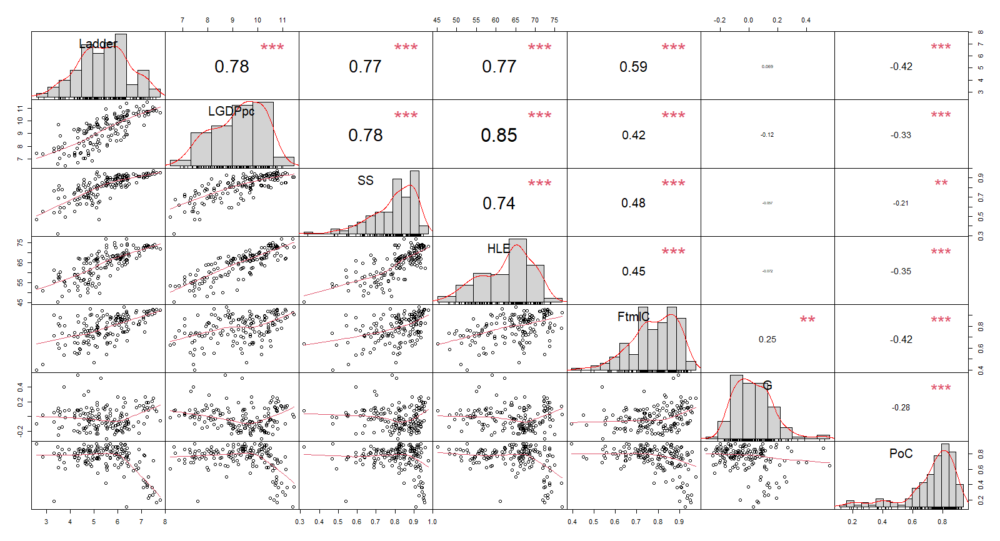
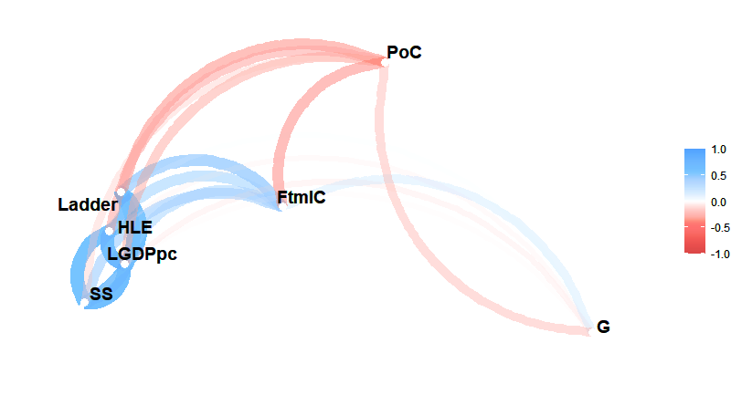
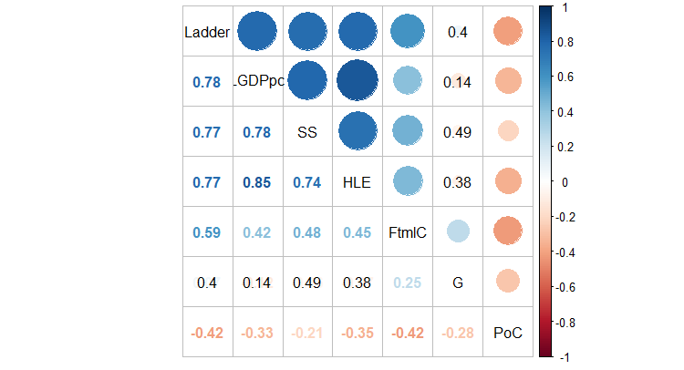
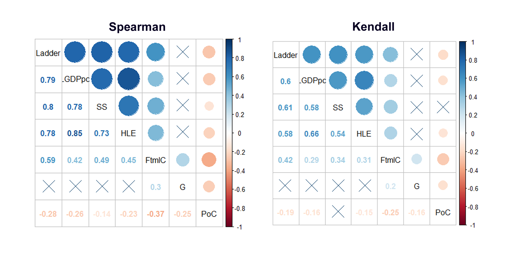

```{r setup, include=FALSE}
knitr::opts_chunk$set(echo = TRUE)
```
```{r echo=FALSE, include=FALSE}
WHR_Data = read.csv("C:\\Statistics_Labs\\L2_Correlate\\whr2020.csv")
happyData<-WHR_Data[,c(2:8)]
library(PerformanceAnalytics)
library(corrr)
```
#  Correlation analysis
\
\

\
\

# Introduction
The World Happiness Report is a landmark survey of the state of global happiness that ranks 153 countries by how happy their citizens perceive themselves to be. The aim of this paper is to perform correlation analysis on numerical data of the WHR2020 social research. Seven variables are taken into consideration: Ladder score(Ladder), Logged GDP per capita(LGDpc), Social security(SS), Healthy life expectancy(HLE), Freedom to make life choices(FtmlC), Generosity(G), Perception of corruption(PoC). Some members of the given populations are negative due to negative trend in development of the corresponding random variable.

# Data summary

```{r}
head(happyData, 7)
```
Note that ***WHR_Data*** also contains non-numerical column with countries' names and cannot be analysed, so its shortened version ***happyData***(=WHR_Data[,c(2:8)]) will be considered.

# Scatterplot

Includes histograms and kernel density functions to visually assess "normality" of the distribution. High correlation rates are clear in case of relationship between Ladder, HLE, LGDPpc, and SS. The PoC-column has middle sufficiency and G-column only correlates with FtmlC.
```{r eval=FALSE}
chart.Correlation(happyData, histogram=TRUE, pch="+")
```


Pearson's coefficient is a statistic that measures linear correlation between two random variables. Defined as 

$$
\begin{aligned}\large
\rho_{\xi,\nu}=\frac{cov(\xi,\nu)}{\sqrt{D_\xi D_\nu}}
\end{aligned}
$$

where $cov(\xi, \nu)$ is covariance and $D_\xi$ and $D_\nu$ are variances of the random variables respectively. It is assumed, the variables have normal(or almost normal) distribution. Positive correlation coefficient(CC) implies more $\mapsto$ more relationship and in negative case, more $\mapsto$ less. This processes happen **as a rule**, because, according to the CC's definition, the covariance is divided by the normalized product of variances which in turn means that the CC aims to minimize the effect of outliers using standard deviations. And it makes sense, since growth of deviances results into CC value's decrease and vice versa.
Zero correlation implies absence of linear dependency, but there might be any other functional dependency. If one(or both) of the deviations is equal to zero, the slope of the relationship is equal to zero, and the CC is therefore undefined.

# Correlation matrix

Plotting methods enable smart approach to render correlation heatmaps using hierarchical clustering algorithms. In this way, the CC matrix elements create heat groups which vary depending on the values they contain. 

```{r include=FALSE}
library(ggplot2)
library(reshape2)
cormat<-round(cor(happyData),2)
melted_cormat<-melt(cormat)

# Get lower triangle of the correlation matrix
get_lower_tri<-function(cormat){
  cormat[upper.tri(cormat)] <- NA
  return(cormat)
}
# Get upper triangle of the correlation matrix
get_upper_tri <- function(cormat){
  cormat[lower.tri(cormat)]<- NA
  return(cormat)
}

ggplot(data = melted_cormat, aes(Var2, Var1, fill = value))+
  geom_tile(color = "white")+
  scale_fill_gradient2(low = "blue", high = "red", mid = "white", 
                       midpoint = 0, limit = c(-1,1), space = "Lab", 
                       name="Pearson\nCorrelation") +
  theme_minimal()+ 
  theme(axis.text.x = element_text(angle = 45, vjust = 1, 
                                   size = 12, hjust = 1))+
  coord_fixed()

reorder_cormat <- function(cormat){
  # Use correlation between variables as distance
  dd <- as.dist((1-cormat)/2)
  hc <- hclust(dd)
  cormat <-cormat[hc$order, hc$order]
}
```

```{r}
cormat <- reorder_cormat(cormat)
upper_tri <- get_upper_tri(cormat)
melted_cormat <- melt(upper_tri, na.rm = TRUE)
ggheatmap <- ggplot(melted_cormat, aes(Var2, Var1, fill = value))+
  geom_tile(color = "white")+
  scale_fill_gradient2(low = "blue", high = "red", mid = "white", 
                       midpoint = 0, limit = c(-1,1), space = "Lab", 
                       name="Pearson\nCorrelation") +
  coord_fixed()
ggheatmap + 
  geom_text(aes(Var2, Var1, label = value), color = "black", size = 4) +
  theme(
    axis.title.x = element_blank(),
    axis.title.y = element_blank(),
    legend.justification = c(1, 0),
    legend.position = c(0.5, 0.7),
    legend.direction = "horizontal")+
  guides(fill = guide_colorbar(barwidth = 7, barheight = 1,
                               title.position = "top", title.hjust = 0.5))
```

# Correlation graph

The vertexes are the names of random variables and the edges visualise properties of the relationship.

```{r eval=FALSE}
network_plot(correlate(happyData), min_cor=0.01)
```


Colour(and its intensivity) as well as distance between vertexes outline strength of association.

# Comparison of three CC measurement methods
The following plots outline results of correlation measurement using three methods. 
```{r, eval=FALSE}
res <- cor.mtest(happyData, conf.level = 0.95)
corrplot.mixed(cor(happyData), p.mat = res$p, insig = "p-value", tl.col="black")
```
## Pearson's coefficient

As mentioned above, Pearson's CC uses parametric approach to estimate association. It is less sensitive to outliers than the other methods. Due to quite elliptic position of points, in the majority of cases, Pearson's and Spearman's coefficients differ in rather smaller extend. The p-values of non-sufficient relationships are coloured black and depict the value of the statistic criterion with null hypothesis that assumes that the random variables are independent.


<center>

</center>

## Spearman's and Kendall's CC

They introduce ranking of population's elements in order to compare their values or quantity with each other. Whereas Pearson's CC test the linear relation of variables, the other two check their monotony. There should be no ties to guarantee the relevance of the methods.


Crosses in the plots outline low correlation(<0.1).
Spearman's CC is defined as

$$
\begin{aligned} \large 
r_s = 1 - \frac{6\sum{d_i^2}}{n(n^2-1)}
\end{aligned}
$$

where $d_i=rg(X_i)-rg(Y_i)$ is the difference between two ranks of each observation.\
Kendall's CC formal definition is

$$
\begin{aligned} \large 
\tau = \frac{2}{n(n-1)} \sum_{i<j}sgn(x_i-x_j)sgn(y_i-y_j)
\end{aligned}
$$

# Pearson's CC and its significance interval

Assume Pearson's CC is calculated:
```{r}
cor.test(happyData$Ladder, happyData$SS, method = "pearson")
```

**t** is the value of the t-test statistic criterion which follows Student's t-distribution. **df** is amount of degrees of freedom which are in turn passed to the t-test, provided that samples follow independent normal distributions. p-value is the prior probability of obtaining an effect that is at least as extreme as the observed effect, given that the null hypothesis is true. In this case, p-value is much less than the significance level $\alpha=0.05$, which implies that the null hypothesis should be rejected, because the CC is significantly different from 0.

## Confidence interval

Unlike confidence intervals around means, confidence intervals around Pearson's CC(we shall denote it as r for simplicity) are not symmetrical. This is because the distribution of the r is itself skewed rather than symmetrical (for example, with a high r, say r = 0.95, the actual population correlation couldn't be any higher than 1.0, but it could be substantially lower).

The confidence interval around r is based on Fisher’s z transformation. In particular, suppose a sample of n  $X_i-Y_i$ pairs produces some value of Pearson's r. Given the transformation,

$$
\begin{aligned} \large 
z=0.5ln(\frac{1+r}{1-r})
\end{aligned}
$$
z is approximately normally distributed, with an expectation equal to

$$
\begin{aligned} \large 
0.5ln(\frac{1+\rho}{1-\rho})
\end{aligned}
$$
where $\rho$ is the population correlation of which r is an estimate, and a standard deviation of

$$
\begin{aligned} \large 
\sigma_z=\sqrt{(n-3)^{-1}}
\end{aligned}
$$

Therefore, having computed an obtained z from the obtained r via Fisher's z transformation, a confidence interval can be constructed in z-space as


$$
\begin{aligned} \large 
-\Phi(z)\sigma_z \leq z \leq \Phi(z)\sigma_z
\end{aligned}
$$
where $\sigma_z$ is the sample standard deviation and $\Phi(z)$ corresponds to the desired confidence level (e.g., 1.96 in the case of a 95% confidence interval) and defined as

$$
\begin{aligned} \large 
\Phi(z)=P(Z\leq z)=P(\frac{\bar{X}-\mu}{\sigma/\sqrt{n}}\leq z)=1-\frac{\alpha}{2}
\end{aligned}
$$

in case of normal cumulative distribution function. The upper and lower z limits of this confidence interval can then be transformed back to upper and lower r limits.
In case of our population of n=153  $X_i-Y_i$ pairs, Pearson's CC produces value of r=0.765 and a 95% confidence interval is desired. The obtained z is thus

$$
\begin{aligned} \large 
z=0.5ln(\frac{1.765}{0.235})=1.008
\end{aligned}
$$

which is distributed with a standard deviation of

$$
\begin{aligned} \large 
\sqrt{(153-3)^{-1}}=0.08
\end{aligned}
$$

The upper and lower confidence interval limits in z-space are therefore

$$
\begin{aligned} \large 
1.008 + 0.08*1.96=1.1648
\end{aligned}
$$
and

$$
\begin{aligned} \large 
1.008 - 0.08*1.96=0.8512
\end{aligned}
$$

To translate from z-space back to r-space, it is necessary to invert the Fisher's z transform. It is easily shown that such inversion produces

$$
\begin{aligned} \large 
r=\frac{e^{2z}-1}{e^{2z}+1}
\end{aligned}
$$
The upper and lower confidence-interval limits may then be computed from the above equation:

$$
\begin{aligned} \large 
r_{up}=\frac{e^{2*1.1648}-1}{e^{2*1.1648}+1}=0.823
\end{aligned}
$$
and

$$
\begin{aligned} \large 
r_{l}=\frac{e^{2*0.8512}-1}{e^{2*0.8512}+1}=0.691
\end{aligned}
$$

Thus, the 95% confidence interval around the originally obtained r of 0.765 ranges from 0.691 to 0.823

# Conclusion

There is a high correlation rate between 5 of 7 random variables which might be described as quite sufficient. Variable G(Generosity) showed low correlation rate with 4 out of 6 variables and such an association strength is meant to be insufficient. Due to high amount of outliers, Spearman's and Kendall's ranking coefficients' values differed from those produced by the Pearson's test, as the ranking method focuses not on the value of the outlier, but rather on its rank. Nevertheless it is extremely useful to research non-linear patterns with the Spearman's and Kendall's methods, because they are sensitive to the order of the elements, and not their linear dependency. A 95% confidence interval sets an r-space containing the correlation value in 95% of observations of the random variable.


